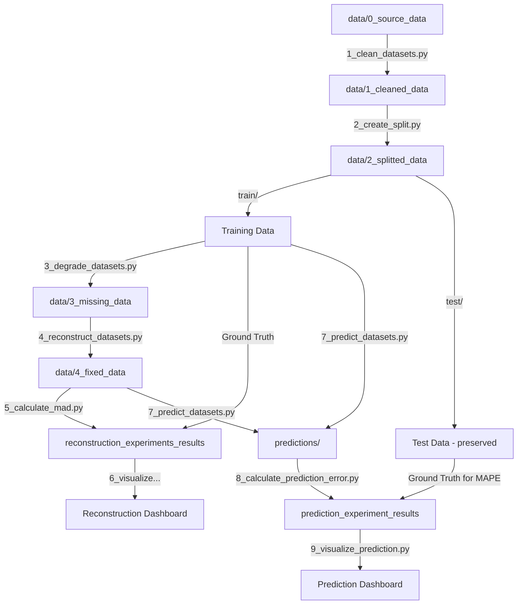

# Univariate Time Series Reconstruction & Prediction Framework

A modular framework for evaluating time series reconstruction methods on univariate datasets with various types of missing data, with support for prediction task evaluation.

**Framework name**: uniTS-MissRecoPred

[](https://www.python.org/downloads/)
[](LICENSE)

## 📋 Table of Contents

- [✨ Features](#-features)
- [📁 Project Structure](#-project-structure)
- [🚀 Quick Start](#-quick-start)
  - [Setup Virtual Environment](#1-setup-virtual-environment-recommended)
  - [Installation](#2-installation)
  - [Configuration](#3-configure-experiment)
  - [Run Pipeline](#4-run-pipeline)
  - [Common Commands](#5-common-commands)
- [⚙️ Configuration](#-configuration)
- [🔄 Workflow](#-workflow)
- [📊 Output Files](#-output-files)
- [📈 Visualization](#-visualization)
- [🎯 Advanced Usage](#-advanced-usage)
  - [Running with tmux](#running-long-experiments-with-tmux)
  - [Custom Parameters](#custom-parameters-via-cli)
  - [Hyperparameter Optimization](#optimizing-stable-diffusion-hyperparameters)
  - [Available Models](#available-models)
- [📝 Adding New Models](#-adding-new-models)
- [🧹 Cleanup](#-cleanup)
- [📈 Performance Estimates](#-performance-estimates)
- [⚠️ Important Notes](#-important-notes)
- [🤝 Citation](#-citation)

## ✨ Features

- **20+ Reconstruction Models**: From simple imputation to deep learning (Stable Diffusion 2)
- **3 Missingness Patterns**: MCAR, MAR, MNAR with configurable rates
- **Train/Test Split**: Temporal split preserving time series structure for prediction tasks
- **Automatic Discovery**: Auto-detects datasets, models, and techniques
- **Configuration-Based**: YAML config for easy experiment management
- **Interactive Visualization**: Streamlit dashboard for result analysis
- **Modular Design**: Easy to add new models and techniques
- **MAD Metric**: Measures reconstruction quality only on missing values

## 📁 Project Structure

```
uniTS-MissRecoPred/
│
├── 📁 src/                                 # Source code directory
│   ├── 🐍 1_clean_datasets.py              # [MAIN] Clean and validate raw data
│   ├── 🐍 2_create_split.py                # [MAIN] Split into train/test sets
│   ├── 🐍 3_degrade_datasets.py            # [MAIN] Introduce missing data (training)
│   ├── 🐍 4_reconstruct_datasets.py        # [MAIN] Reconstruct missing data
│   ├── 🐍 5_calculate_mad.py               # [MAIN] Calculate MAD metric
│   ├── 🐍 6_visualize_mad_comparison.py    # [MAIN] Streamlit dashboard
│   ├── 🐍 7_predict_datasets.py            # [MAIN] Predict future values
│   ├── 🐍 8_calculate_prediction_error.py  # [MAIN] Calculate prediction MAPE
│   ├── 🐍 9_visualize_prediction.py        # [MAIN] Prediction Streamlit dashboard
│   │
│   ├── 📁 utils/                           # Utility modules
│   │   ├── 🐍 config_loader.py                # Configuration manager
│   │   ├── 🐍 performance_metrics.py          # Performance monitoring
│   │   └── 🐍 statistical_tests.py            # Statistical significance tests
│   │
│   ├── 📁 optimization/                    # Hyperparameter optimization
│   │   └── 🐍 optimize_sd_hyperparams.py      # SD hyperparameter tuning
│   │
│   ├── 📁 reconstruction_models/           # 20 reconstruction models
│   │   ├── 🐍 impute_*.py                     # Simple imputation (mean, median, mode, ffill, bfill)
│   │   ├── 🐍 interpolate_*.py                # Interpolation (linear, cubic, spline, etc.)
│   │   ├── 🐍 knn.py                          # K-Nearest Neighbors
│   │   ├── 🐍 sarimax.py                      # SARIMA with Kalman smoothing
│   │   └── 🐍 stable_diffusion_2_*.py         # Stable Diffusion 2 (GAF, MTF, RP, Spectrogram)
│   │
│   ├── 📁 prediction_models/               # 12 prediction models
│   │   ├── 🐍 holt_winters.py                 # Holt-Winters Exponential Smoothing
│   │   ├── 🐍 prophet.py                      # Facebook Prophet
│   │   ├── 🐍 sarimax.py                      # SARIMAX forecasting
│   │   ├── 🐍 xgboost.py                      # XGBoost with lag features
│   │   ├── 🐍 lstm.py                         # LSTM neural network
│   │   ├── 🐍 gru.py                          # GRU neural network
│   │   ├── 🐍 deepar.py                       # DeepAR probabilistic forecasting
│   │   ├── 🐍 temporal_convolutional_network.py  # TCN
│   │   ├── 🐍 nbeats.py                       # N-BEATS architecture
│   │   ├── 🐍 vanilla_transformer.py          # Vanilla Transformer
│   │   └── 🐍 temporal_fusion_transformer.py  # TFT (Temporal Fusion Transformer)
│   │
│   └── 📁 missingness_techniques/          # Missingness patterns
│       ├── 🐍 mcar.py                         # Missing Completely At Random
│       ├── 🐍 mar.py                          # Missing At Random
│       └── 🐍 mnar.py                         # Missing Not At Random
│
├── 📁 data/
│   ├── 📁 0_source_data/                   # Original datasets (auto-discovered)
│   ├── 📁 1_cleaned_data/                  # Cleaned datasets (generated)
│   ├── 📁 2_splitted_data/                 # Train/test split (generated)
│   │   ├── 📁 train/                          # Training data (for reconstruction)
│   │   └── 📁 test/                           # Test data (for prediction)
│   ├── 📁 3_missing_data/                  # Degraded training datasets (generated)
│   └── 📁 4_fixed_data/                    # Reconstructed training datasets (generated)
│
├── 📁 reconstruction_experiments_results/  # Reconstruction experiment results
│   ├── 📝 reconstruction_results_*.csv        # MAD + performance metrics (merged)
│   └── 📁 performance_metrics/                # Performance metrics archive
│       └── 📝 performance_metrics_*.csv       # Individual performance logs
│
├── 📁 prediction_experiment_results/       # Prediction experiment results
│   ├── 📝 prediction_results_*.csv            # MAPE + performance metrics (merged)
│   ├── 📁 predictions/                        # Prediction output files
│   │   └── 📝 {dataset}_{model}_iter{N}.csv   # Individual predictions per iteration
│   └── 📁 performance_metrics/                # Prediction performance logs
│       └── 📝 prediction_metrics_*.csv        # Timing, CPU, RAM usage
│
├── 📁 .streamlit/                          # Streamlit configuration
│   └── ⚙️ config.toml                         # Streamlit settings (file watching disabled)
│
├── 📁 config/                               # Configuration files
│   ├── ⚙️ config.yaml                       # Main configuration file
│   └── ⚙️ prediction_models_config.yaml     # Prediction models training parameters
├── 📝 Makefile                             # Make commands for easy pipeline execution
├── 📝 requirements.txt                     # Python dependencies
├── 📝 setup_venv.sh                        # Setup script (Linux/Mac)
├── 📝 setup_venv.ps1                       # Setup script (Windows)
├── 📝 LICENSE                              # Apache 2.0 License
└── 📝 README.md                            # This file
```

## 🚀 Quick Start

### 1. Setup Virtual Environment (Recommended)

Using a virtual environment ensures isolated dependencies and prevents conflicts.

#### Quick Setup (Recommended):

**Linux/Mac:**
```bash
# Run setup script (creates experiment env and installs dependencies)
chmod +x setup_venv.sh
./setup_venv.sh
```

**Windows (PowerShell):**
```powershell
# Run setup script (creates experiment env and installs dependencies)
.\setup_venv.ps1

# If you get execution policy error, run first:
Set-ExecutionPolicy -ExecutionPolicy RemoteSigned -Scope CurrentUser
```

#### Manual Setup:

**Linux/Mac:**

```bash
# Create virtual environment
python3 -m venv experiment

# Activate virtual environment
source experiment/bin/activate

# You should see (experiment) in your terminal prompt
```

**Windows (PowerShell):**

```powershell
# Create virtual environment
python -m venv experiment

# Activate virtual environment
.\experiment\Scripts\Activate.ps1

# You should see (experiment) in your terminal prompt
```

**Windows (CMD):**

```cmd
# Create virtual environment
python -m venv experiment

# Activate virtual environment
experiment\Scripts\activate.bat
```

#### Deactivate Virtual Environment

When you're done working:

```bash
deactivate
```

### 2. Installation

**After activating your virtual environment**, install dependencies:

```bash
# Install all required packages
pip install -r requirements.txt

# Verify installation
pip list
```

**Key dependencies**:
- `psutil` - CPU and RAM monitoring
- `GPUtil` - GPU monitoring (optional, only if CUDA available)
- `scipy` - Statistical tests (t-tests for model comparison)

If GPU monitoring is not needed, GPUtil can be skipped (performance metrics will still work without it).

### 3. Configure Experiment

Edit `config/config.yaml` to set:
- Datasets to use (auto-discovers all CSVs in `data/0_source_data/`)
- Train/test split configuration (number of test samples)
- Reconstruction models to test
- Missingness techniques (MCAR, MAR, MNAR)
- Missing rates (e.g., 10%, 20%)
- Number of iterations

### 4. Run Pipeline

**Using Makefile (Recommended):**

```bash
# See all available commands
make help

# Option 1: Run complete pipeline
make pipeline

# Option 2: Run step by step
make clean-datasets    # Step 1: Clean and validate raw data
make split             # Step 2: Split into train/test sets
make degrade           # Step 3: Create degraded training datasets
# OPTIONAL: Optimize Stable Diffusion hyperparameters (run once)
make optimize          # Find optimal num_inference_steps and guidance_scale
# Then update config/config.yaml with recommended values
make reconstruct       # Step 4: Reconstruct missing values
make calculate         # Step 5: Calculate MAD metric
make visualize             # Step 6: Launch reconstruction dashboard
make predict               # Step 7: Predict future values (optional)
make calculate-prediction  # Step 8: Calculate prediction error (MAPE)
make visualize-prediction  # Step 9: Launch prediction dashboard


```

**Manual execution (alternative):**

```bash
python src/1_clean_datasets.py        # Clean and validate raw data
python src/2_create_split.py          # Split into train/test sets
python src/3_degrade_datasets.py      # Create degraded training datasets
python src/optimization/optimize_sd_hyperparams.py # OPTIONAL: Optimize Stable Diffusion
python src/4_reconstruct_datasets.py  # Reconstruct missing values
python src/5_calculate_mad.py         # Calculate MAD metric
streamlit run src/6_visualize_mad_comparison.py  # Visualize results
python src/7_predict_datasets.py      # Predict future values (optional)
python src/8_calculate_prediction_error.py  # Calculate prediction MAPE
streamlit run src/9_visualize_prediction.py  # Visualize prediction results
```

**💡 Tip**: For long-running experiments, use `tmux` to keep processes running in background:
```bash
# Start tmux session
tmux new -s experiments

# Run reconstruction (may take hours with Stable Diffusion)
python src/4_reconstruct_datasets.py

# Detach: Ctrl+B then D
# Reattach later: 
tmux attach -t experiments
```
See [Running Long Experiments with tmux](#running-long-experiments-with-tmux) for details.

### 5. Common Commands

**Using Makefile (Linux/Mac):**

```bash
# View all available commands
make help

# Quick test (limited data, fast)
make test

# Setup from scratch
make setup          # Create virtual environment
make install        # Install dependencies

# Full workflow
make pipeline       # Run reconstruction pipeline (steps 1-5)
make pipeline-full  # Run full pipeline including prediction (steps 1-5, 7)
make visualize      # View results

# Cleanup
make clean          # Remove generated data
make clean-all      # Remove everything including results
```

**Note**: Windows users can use the manual commands or setup WSL (Windows Subsystem for Linux) to use Makefile.

## ⚙️ Configuration

The framework uses `config/config.yaml` for all settings:

```yaml
# Data directories
data:
  raw_source_dir: "data/0_source_data"     # Raw input data
  cleaned_dir: "data/1_cleaned_data"       # Cleaned data
  splitted_dir: "data/2_splitted_data"     # Train/test split
  splitted_train_dir: "data/2_splitted_data/train"  # Training data
  splitted_test_dir: "data/2_splitted_data/test"    # Test data
  source_dir: "data/2_splitted_data/train" # Source for degradation (training)
  missing_dir: "data/3_missing_data"
  fixed_dir: "data/4_fixed_data"
  results_dir: "reconstruction_experiments_results"

# Train/test split settings
split:
  test_samples: 100  # Last N samples for test set per dataset

# Datasets (empty = auto-discover all CSVs)
datasets:
  selected: []  # Or specify: ["dataset1.csv", "dataset2.csv"]
  
# Models (empty = use all available)
reconstruction_models:
  selected: []  # Or specify: ["interpolate_linear", "knn"]
  excluded:     # Exclude specific models (e.g., GPU-only)
    # - "stable_diffusion_2_gaf"
    
# Missingness techniques (empty = use all)
missingness_techniques:
  selected: []  # Or specify: ["MCAR", "MAR"]
  
# Missingness rates
missingness_rates:
  rates: [0.10, 0.20]  # 10%, 20%
  iterations: 2
  seed: 42

# Computation settings
computation:
  overwrite_existing: false  # Set to true to overwrite existing files
  n_jobs: 4                  # Parallel processing: 1=sequential, 4=use 4 cores, -1=use all cores
  
  # Stable Diffusion hyperparameters (use optimize_sd_hyperparams.py to find optimal values)
  stable_diffusion:
    num_inference_steps: 50  # Default: 50. Lower=faster but less accurate. Optimize with optimize_sd_hyperparams.py
    guidance_scale: 7.5      # Default: 7.5. Controls adherence to prompt (1-20)
    device: "cuda"           # "cuda" for GPU or "cpu"
```

### Parallel Processing

The framework supports **parallel processing** for faster experiments:

- **`n_jobs: 4`** - Use 4 CPU cores (3-4x faster)
- **`n_jobs: -1`** - Use all available CPU cores  
- **`n_jobs: 1`** - Sequential processing (disable parallelization)

**Smart GPU Detection**: GPU models (Stable Diffusion) automatically run sequentially even when `n_jobs > 1`, preventing GPU memory conflicts.

### Prediction Models Configuration

The framework uses a separate `config/prediction_models_config.yaml` for prediction model settings:

```yaml
# Global training settings
global_training:
  validation_split: 0.2       # 80% train, 20% validation
  seed: 42                    # Base random seed
  max_epochs: 100             # Maximum training epochs
  batch_size: 32              # Training batch size
  training_iterations: 5      # N iterations for non-deterministic models

# Early stopping
early_stopping:
  enabled: true
  patience: 10
  min_delta: 0.001

# Model-specific parameters (lstm, gru, tcn, nbeats, vanilla_transformer, temporal_fusion_transformer, xgboost, etc.)
lstm:
  input_chunk_length: 24
  hidden_dim: 32
  n_layers: 2

vanilla_transformer:
  input_chunk_length: 24
  d_model: 64
  nhead: 4

temporal_fusion_transformer:
  input_chunk_length: 24
  hidden_size: 64
  num_attention_heads: 4

# Model categories
model_categories:
  global_training_models:      # Trained ONCE on ALL data (deep learning)
    - lstm, gru, deepar, tcn, nbeats, vanilla_transformer, temporal_fusion_transformer
  per_file_training_models:    # Trained separately per file (statistical)
    - sarimax, holt_winters, prophet
  deterministic_models:        # Always same output, 1 iteration
    - sarimax, holt_winters, prophet
  non_deterministic_models:    # Random init, N iterations for statistics
    - lstm, gru, deepar, tcn, nbeats, vanilla_transformer, temporal_fusion_transformer, xgboost
```

**Training Iterations**: Non-deterministic models (deep learning, XGBoost) are trained N times with different random seeds for statistical analysis. Deterministic models (SARIMAX, Holt-Winters, Prophet) are trained only once.

**Example speedup** (4 cores):
- 72 degradations: 10 min → 3 min
- 1,152 reconstructions: 40 min → 10 min

**Note**: Hyperparameter optimization (`optimize_sd_hyperparams.py`) runs sequentially on GPU models and may take several hours depending on the number of test cases and parameter combinations

## 📝 Input Data Requirements

To ensure optimal results, verify your source data in `data/0_source_data/` meets these requirements before running the pipeline.

### Required CSV Format
Your input files should be **standard CSV files** with **two columns**:

1.  **Column 1 (Index/Time)**:
    *   **Type**: Datetime (ISO format preferred: `YYYY-MM-DD HH:MM:SS`) OR Numeric (Integer/Float steps).
    *   **Constraint**: Must be unique (no duplicate timestamps) and monotonic.
2.  **Column 2 (Value)**:
    *   **Type**: Numeric (Float).
    *   **Constraint**: The univariate time series data to be analyzed.

**Example `my_dataset.csv`**:
```csv
timestamp,value
2024-01-01 10:00:00,24.5
2024-01-01 10:15:00,24.8
2024-01-01 10:30:00,25.1
```

### Best Practices
*   **Separators**: Use comma `,` as separator and dot `.` as decimal point.
*   **Cleanliness**: Although `1_clean_datasets.py` attempts to fix issues, provide clean data to avoid ambiguity.
*   **Length**: For Stable Diffusion models, ensure sufficient length (e.g., > 100 points) for meaningful patterns.
*   **Test samples**: Ensure your time series has more samples than `test_samples` configured in config/config.yaml.

## 🔄 Workflow

This framework follows a strict data pipeline where each script transforms data from one state to another.

### 📋 Pipeline Roadmap

#### 1. Data Cleaning
*   **Script**: `src/1_clean_datasets.py`
*   **📥 INPUT**: Raw CSV files in `data/0_source_data/`
    *   *Requirement*: Any CSV with at least 2 columns.
*   **📤 OUTPUT**: Standardized CSV files in `data/1_cleaned_data/`
    *   *Format*: UTF-8, Comma-separated, Index + Value, No missing values, Validated types.

#### 2. Train/Test Split
*   **Script**: `src/2_create_split.py`
*   **📥 INPUT**: Cleaned CSV files in `data/1_cleaned_data/`
*   **📤 OUTPUT**: Split CSV files in `data/2_splitted_data/`
    *   `train/` - Training data (all but last N samples) - used for reconstruction experiments
    *   `test/` - Test data (last N samples) - preserved for prediction evaluation
*   **Note**: N is configured via `split.test_samples` in config/config.yaml

#### 3. Degradation (Introduction of Missing Data)
*   **Script**: `src/3_degrade_datasets.py`
*   **📥 INPUT**: Training CSV files in `data/2_splitted_data/train/`
*   **📤 OUTPUT**: Degraded CSV files in `data/3_missing_data/`
    *   *Format*: `{dataset}_{technique}_{rate}p_{iteration}.csv`
    *   *Content*: Same as input but with specific values replaced by `NaN` according to technique (MCAR/MAR/MNAR).

#### 4. Reconstruction (The Core Task)
*   **Script**: `src/4_reconstruct_datasets.py`
*   **📥 INPUT**: Degraded CSV files in `data/3_missing_data/` (containing `NaNs`)
*   **📤 OUTPUT**: Reconstructed CSV files in `data/4_fixed_data/`
    *   *Format*: `{dataset}_{technique}_{rate}p_{iter}_{model}.csv`
    *   *Content*: `NaN` values filled with reconstructed estimates. Non-missing values are preserved exactly.
*   **📝 METRICS OUTPUT**: `reconstruction_experiments_results/performance_metrics/*.csv` (Time, CPU, RAM usage logs).

#### 5. Evaluation
*   **Script**: `src/5_calculate_mad.py`
*   **📥 INPUT**: 
    1.  **Reconstructed Data** from `data/4_fixed_data/` (The solution)
    2.  **Ground Truth Data** from `data/2_splitted_data/train/` (The original training data)
*   **📤 OUTPUT**: `reconstruction_experiments_results/reconstruction_results_*.csv`
    *   *Content*: A comprehensive summary CSV containing MAD scores (quality) and performance metrics (efficiency) for every test case.

#### 6. Visualization
*   **Script**: `src/6_visualize_mad_comparison.py`
*   **📥 INPUT**: Results CSV from `reconstruction_experiments_results/`
*   **📤 OUTPUT**: Interactive Streamlit Dashboard (Web Interface).

#### 7. Prediction
*   **Script**: `src/7_predict_datasets.py`
*   **📥 INPUT**: 
    1.  **Training Data** from `data/2_splitted_data/train/` (original) and/or
    2.  **Reconstructed Data** from `data/4_fixed_data/` (reconstructed training data)
*   **📤 OUTPUT**: Prediction files in `prediction_experiment_results/predictions/`
    *   *Format*: `{dataset}_{model}_iter{N}.csv` (for non-deterministic models)
    *   *Format*: `{dataset}_{model}.csv` (for deterministic models)
    *   *Content*: `predicted` column with forecasted values, `iteration` column for statistical analysis
*   **📝 METRICS OUTPUT**: `prediction_experiment_results/performance_metrics/*.csv`
*   **🔄 TRAINING**:
    *   **Global training** (deep learning): One model trained on ALL data, then predicts for each file
    *   **Per-file training** (statistical): Separate model trained for each file
    *   **N iterations** (non-deterministic): Models trained N times with different seeds for statistical analysis

#### 8. Prediction Error Evaluation
*   **Script**: `src/8_calculate_prediction_error.py`
*   **📥 INPUT**: 
    1.  **Predictions** from `prediction_experiment_results/predictions/`
    2.  **Test Data (Ground Truth)** from `data/2_splitted_data/test/`
*   **📤 OUTPUT**: `prediction_experiment_results/prediction_results_*.csv`
    *   *Content*: MAPE, MAE, RMSE, and performance metrics for every prediction
*   **📊 METRICS**:
    *   **MAPE** - Mean Absolute Percentage Error (%)
    *   **MAE** - Mean Absolute Error
    *   **RMSE** - Root Mean Square Error

#### 9. Prediction Visualization (Optional)
*   **Script**: `src/9_visualize_prediction.py`
*   **📥 INPUT**: `prediction_experiment_results/prediction_results_*.csv`
*   **📤 OUTPUT**: Interactive Streamlit dashboard at `http://localhost:8501`
*   **📊 FEATURES**:
    *   MAPE comparison by prediction model, source type, reconstruction model
    *   Heatmaps: prediction model vs reconstruction model, prediction model vs technique
    *   Statistical significance tests (pairwise t-tests)
    *   Iteration variance analysis (for non-deterministic models)
    *   Performance metrics visualization
    *   Best/worst model rankings

---



## 📊 Output Files

### Degraded Datasets
**Format**: `{dataset}_{technique}_{rate}p_{iteration}.csv`

**Example**: `boiler_MCAR_10p_1.csv`
```
└─┬──┘ └┬─┘  └─┬┘ └┘
  │     │      │   └─ Iteration: 1
  │     │      └───── Rate: 10%
  │     └─────────── Technique: MCAR
  └───────────────── Dataset: boiler
```

### Reconstructed Datasets
**Format**: `{dataset}_{technique}_{rate}p_{iteration}_{model}.csv`

**Example**: `boiler_MCAR_10p_1_interpolate_linear.csv`
```
└─┬──┘ └┬─┘  └─┬┘ └┘ └────────┬──────────┘
  │     │      │   │           └─ Model: interpolate_linear
  │     │      │   └───────────── Iteration: 1
  │     │      └───────────────── Rate: 10%
  │     └─────────────────────── Technique: MCAR
  └───────────────────────────── Dataset: boiler
```

### Results Files
**Format**: `reconstruction_results_YYYYMMDD_HHMMSS.csv`

**Columns**:
- `dataset_name` - Dataset name
- `technique` - Missingness technique (MCAR/MAR/MNAR)
- `rate_percent` - Missing rate (%)
- `iteration` - Iteration number
- `model` - Reconstruction model name
- `mad` - **Mean Absolute Difference** (only for missing values!)
- `max_diff` - Maximum difference
- `min_diff` - Minimum difference
- `std_diff` - Standard deviation of differences
- `n_missing` - Number of missing values reconstructed
- `n_total` - Total number of values in dataset

### Performance Metrics

**Two locations for performance data:**

1. **`reconstruction_experiments_results/performance_metrics/performance_metrics_YYYYMMDD_HHMMSS.csv`** - Archive of performance metrics
   - Created during reconstruction (step 4)
   - Permanent record of computational performance
   - Includes timestamp for each reconstruction session

2. **`reconstruction_experiments_results/reconstruction_results_YYYYMMDD_HHMMSS.csv`** - Merged results
   - Combines MAD metrics + performance metrics
   - Created during evaluation (step 5)
   - Single file for easy analysis

**Performance Metrics Columns**:
- `dataset_name` - Dataset name
- `technique` - Missingness technique
- `rate_percent` - Missing rate (%)
- `iteration` - Iteration number
- `model` - Reconstruction model name
- `time_seconds` - **Execution time in seconds**
- `cpu_cores_used` - **CPU cores utilized** (e.g., 1.18 = using 1.18 cores)
- `cpu_cores_total` - **Total CPU cores available** (e.g., 4, 8, 16)
- `memory_mb` - **Peak RAM usage (MB)**
- `memory_total_mb` - **Total system RAM available (MB)**
- `gpu_percent` - GPU utilization (%) - *null if GPU not available*
- `gpu_memory_mb` - GPU memory usage (MB) - *null if GPU not available*
- `gpu_memory_total_mb` - **Total GPU memory available (MB)** - *null if GPU not available*
- `timestamp` - When reconstruction was performed

## 🎯 Advanced Usage

### Running Long Experiments with tmux

For long-running experiments (especially with Stable Diffusion models), use `tmux` to keep the process running even after disconnecting:

```bash
# Start a new tmux session
tmux new -s experiment

# Inside tmux, activate virtual environment and run experiments
source experiment/bin/activate
python src/4_reconstruct_datasets.py

# Detach from tmux session (keeps it running in background)
# Press: Ctrl+B, then D

# Reattach to the session later
tmux attach -t experiment

# List all tmux sessions
tmux ls

# Kill a session when done
tmux kill-session -t experiments
```

**Useful tmux commands**:
- `Ctrl+B` then `D` - Detach from session (process keeps running)
- `Ctrl+B` then `C` - Create new window
- `Ctrl+B` then `N` - Next window
- `Ctrl+B` then `P` - Previous window
- `Ctrl+B` then `[` - Scroll mode (use arrows, `Q` to exit)

**Why use tmux?**:
- Experiments continue running even if SSH disconnects
- Run multiple experiments in parallel windows
- Monitor progress in one window, logs in another
- Return to check progress anytime without interrupting

### Custom Parameters via CLI

For custom parameters, use the scripts directly instead of Makefile:

```bash
# Split with custom test samples
python src/2_create_split.py --test-samples 200

# Degrade specific datasets
python src/3_degrade_datasets.py --dataset-files data/2_splitted_data/train/boiler.csv

# Use custom config
python src/3_degrade_datasets.py --config config/my_config.yaml

# Override config parameters
python src/3_degrade_datasets.py --techniques MCAR --rates 0.05 0.10 --iterations 3

# Reconstruct with specific models
python src/4_reconstruct_datasets.py --models interpolate_linear knn

# Calculate with custom config
python src/5_calculate_mad.py --config config/my_config.yaml

# Prediction with specific models
python src/7_predict_datasets.py --models holt_winters lstm xgboost

# Override number of training iterations
python src/7_predict_datasets.py --iterations 10
```

**Quick test with Makefile** (limited data for fast testing):

```bash
# Runs: MCAR 10% 1 iteration with only 2 models
make test
```

### Optimizing Stable Diffusion Hyperparameters

The framework includes a dedicated script to find **globally good** `num_inference_steps` and `guidance_scale` using **Bayesian optimization (Optuna/TPE)**. This typically requires **orders of magnitude fewer evaluations** than exhaustive grid search.

```bash
# Quick test (limit to first 5 files, 20 trials per model)
python src/optimization/optimize_sd_hyperparams.py \
  --method optuna \
  --n-trials 20 \
  --steps 10 20 30 50 \
  --guidance 5.0 7.5 10.0 \
  --max-files 5

# Standard run (recommended)
python src/optimization/optimize_sd_hyperparams.py \
  --method optuna \
  --n-trials 100 \
  --max-files 20

# Full run (ALL degraded datasets, may take hours)
python src/optimization/optimize_sd_hyperparams.py \
  --method optuna \
  --n-trials 200
```

**⚠️ Important:** 
- Run optimization AFTER generating degraded datasets with `3_degrade_datasets.py`

### Available Models

#### Simple Imputation (5 models)
- `impute_mean` - Replace with mean
- `impute_median` - Replace with median
- `impute_mode` - Replace with mode
- `impute_ffill` - Forward fill
- `impute_bfill` - Backward fill

#### Interpolation (9 models)
- `interpolate_linear` - Linear interpolation
- `interpolate_cubic` - Cubic interpolation
- `interpolate_quadratic` - Quadratic interpolation
- `interpolate_nearest` - Nearest neighbor
- `interpolate_index` - Index-based
- `interpolate_polynomial` - Polynomial (order 2)
- `interpolate_pchip` - PCHIP (monotonic)
- `interpolate_akima` - Akima (smooth curves)
- `interpolate_spline` - Spline (order 2)

#### Advanced (6 models)
- `knn` - K-Nearest Neighbors
- `sarimax` - SARIMA with Kalman smoothing
- `stable_diffusion_2_gaf` - Stable Diffusion 2 + GAF encoding
- `stable_diffusion_2_mtf` - Stable Diffusion 2 + MTF encoding
- `stable_diffusion_2_rp` - Stable Diffusion 2 + RP encoding
- `stable_diffusion_2_spec` - Stable Diffusion 2 + Spectrogram

### Missingness Techniques

- **MCAR** (Missing Completely At Random): Random uniform distribution
- **MAR** (Missing At Random): Probability depends on deviation from median
- **MNAR** (Missing Not At Random): Probability increases over time (sensor degradation)

### Available Prediction Models

The framework includes **12 prediction models** spanning statistical, machine learning, and deep learning approaches.

---

#### Statistical Models (Deterministic, Per-File Training)

These models are trained separately for each time series file. They are deterministic (same input → same output), so only 1 iteration is performed.

##### `holt_winters` - Holt-Winters Exponential Smoothing
- **Type**: Statistical / Exponential Smoothing
- **Library**: `statsmodels.tsa.holtwinters.ExponentialSmoothing`
- **Description**: Classic triple exponential smoothing method that captures **level, trend, and seasonality** components. Uses weighted averages with exponentially decreasing weights for older observations.
- **Strengths**: Simple, fast, interpretable, works well with clear seasonal patterns
- **Weaknesses**: Assumes single seasonal period, sensitive to outliers
- **Parameters**: `seasonal_periods` (auto-detected), `trend` (additive), `seasonal` (additive)

##### `prophet` - Facebook Prophet
- **Type**: Statistical / Bayesian Additive Model
- **Library**: `prophet`
- **Description**: Developed by Facebook (Meta) for business forecasting. Uses **decomposable additive model**: `y(t) = g(t) + s(t) + h(t) + ε(t)` where g(t) is trend, s(t) is seasonality, h(t) is holiday effects. Handles missing data and outliers automatically.
- **Strengths**: Automatic seasonality detection (daily, weekly, yearly), robust to missing data, interpretable components
- **Weaknesses**: Slower than simple methods, designed for daily/hourly business data
- **Parameters**: `changepoint_prior_scale`, `seasonality_prior_scale`, `yearly_seasonality`, `weekly_seasonality`

##### `sarimax` - Seasonal ARIMA with Exogenous Variables
- **Type**: Statistical / Autoregressive Model
- **Library**: `statsmodels.tsa.statespace.sarimax.SARIMAX`
- **Description**: **S**easonal **A**uto**R**egressive **I**ntegrated **M**oving **A**verage with e**X**ogenous variables. Combines AR (past values), I (differencing), MA (past errors), and seasonal components. The gold standard for univariate time series forecasting.
- **Strengths**: Mathematically rigorous, well-understood theory, handles seasonality
- **Weaknesses**: Requires stationarity, sensitive to parameter selection, can be slow for long series
- **Parameters**: `order` (p,d,q), `seasonal_order` (P,D,Q,s), auto-selected using AIC/BIC

---

#### Machine Learning Models (Non-Deterministic, Global Training)

##### `xgboost` - Extreme Gradient Boosting
- **Type**: Machine Learning / Gradient Boosting
- **Library**: `xgboost`
- **Description**: Ensemble of decision trees using **gradient boosting** framework. For time series, uses **lag features** (past N values as input features) to predict the next value. Performs **recursive forecasting**: predicts one step, adds to history, predicts next step.
- **Strengths**: Handles non-linear patterns, feature importance, robust to overfitting, fast training
- **Weaknesses**: No native sequence handling, requires feature engineering (lags)
- **Parameters**: `lags` (number of lag features), `n_estimators`, `max_depth`, `learning_rate`
- **Training**: Global (one model for all series)

---

#### Deep Learning Models (Non-Deterministic, Global Training)

These models are trained once on ALL time series data (global training), then used to predict each file. Non-deterministic models are trained N times with different random seeds for statistical analysis.

##### `lstm` - Long Short-Term Memory
- **Type**: Deep Learning / Recurrent Neural Network
- **Library**: `darts.models.RNNModel` (PyTorch backend)
- **Description**: Recurrent neural network with **memory cells** and **gating mechanisms** (input, forget, output gates). Designed to capture **long-range dependencies** in sequential data. Addresses vanishing gradient problem of vanilla RNNs.
- **Architecture**: 
  ```
  Input → [LSTM Layer 1] → [LSTM Layer 2] → ... → Dense → Output
  Each LSTM cell: forget gate, input gate, cell state, output gate
  ```
- **Strengths**: Captures long-term dependencies, handles variable-length sequences, proven in NLP/speech
- **Weaknesses**: Sequential processing (slow training), can overfit on small datasets
- **Parameters**: `input_chunk_length`, `training_length`, `hidden_dim`, `n_layers`, `dropout`

##### `gru` - Gated Recurrent Unit
- **Type**: Deep Learning / Recurrent Neural Network
- **Library**: `darts.models.RNNModel` (PyTorch backend)
- **Description**: Simplified variant of LSTM with **fewer gates** (reset and update gates only). Combines forget and input gates into single "update gate". Often performs similarly to LSTM with **fewer parameters** and **faster training**.
- **Architecture**: 
  ```
  Input → [GRU Layer 1] → [GRU Layer 2] → ... → Dense → Output
  Each GRU cell: reset gate, update gate, hidden state
  ```
- **Strengths**: Faster than LSTM, fewer parameters, similar performance
- **Weaknesses**: May underperform LSTM on very long sequences
- **Parameters**: `input_chunk_length`, `training_length`, `hidden_dim`, `n_layers`, `dropout`

##### `deepar` - DeepAR Probabilistic Forecasting
- **Type**: Deep Learning / Probabilistic RNN
- **Library**: `darts.models.RNNModel` with `GaussianLikelihood`
- **Description**: Developed by **Amazon** for demand forecasting. LSTM-based model that outputs **probability distributions** (not point estimates). Uses autoregressive recurrent network trained on multiple related time series.
- **Key Feature**: Outputs mean + variance (uncertainty quantification)
- **Architecture**: 
  ```
  Input → LSTM Encoder → Gaussian Likelihood Layer → μ (mean), σ (std)
  ```
- **Strengths**: Uncertainty quantification, handles multiple related series, robust to noise
- **Weaknesses**: More complex, requires more data for good calibration
- **Parameters**: `input_chunk_length`, `training_length`, `hidden_dim`, `n_layers`, `likelihood`

##### `tcn` - Temporal Convolutional Network
- **Type**: Deep Learning / Convolutional Network
- **Library**: `darts.models.TCNModel` (PyTorch backend)
- **Description**: Uses **1D dilated causal convolutions** instead of recurrence. **Causal**: output depends only on past inputs. **Dilated**: exponentially increasing receptive field without increasing parameters. Often outperforms RNNs with **parallel training**.
- **Architecture**: 
  ```
  Input → [Dilated Conv d=1] → [Dilated Conv d=2] → [Dilated Conv d=4] → ... → Output
  Residual connections between layers
  ```
- **Strengths**: Parallel training (fast), large receptive field, stable gradients
- **Weaknesses**: Fixed receptive field, may need tuning for very long sequences
- **Parameters**: `input_chunk_length`, `output_chunk_length`, `kernel_size`, `num_filters`, `dilation_base`

##### `nbeats` - Neural Basis Expansion Analysis for Time Series
- **Type**: Deep Learning / Pure Deep Learning
- **Library**: `darts.models.NBEATSModel` (PyTorch backend)
- **Description**: Developed by **Element AI** (2020). Pure deep learning architecture **without RNNs or attention**. Uses **stack of fully connected layers** with backward and forward residual links. Interpretable variant decomposes into trend and seasonality.
- **Architecture**: 
  ```
  Input → Stack 1 [Blocks] → Stack 2 [Blocks] → ... → Stack N [Blocks]
  Each Block: FC layers → Backcast (reconstruct input) + Forecast (predict future)
  ```
- **Strengths**: State-of-the-art accuracy, interpretable variant available, no sequence modeling assumptions
- **Weaknesses**: Many hyperparameters, requires significant data
- **Parameters**: `input_chunk_length`, `output_chunk_length`, `num_stacks`, `num_blocks`, `num_layers`, `layer_widths`, `generic_architecture`

##### `vanilla_transformer` - Vanilla Transformer
- **Type**: Deep Learning / Attention-based
- **Library**: `darts.models.TransformerModel` (PyTorch backend)
- **Description**: Original **Transformer architecture** (Vaswani et al., 2017) adapted for time series. Uses **encoder-decoder self-attention** mechanism. Each position can attend to all other positions, capturing global dependencies.
- **Architecture**: 
  ```
  Input → Positional Encoding → [Encoder: Multi-Head Self-Attention + FFN] × N
                              → [Decoder: Masked Self-Attention + Cross-Attention + FFN] × N → Output
  ```
- **Strengths**: Captures global dependencies, parallel training, proven in NLP
- **Weaknesses**: Quadratic complexity O(n²), no explicit temporal bias, may need more data
- **Parameters**: `input_chunk_length`, `output_chunk_length`, `d_model`, `nhead`, `num_encoder_layers`, `num_decoder_layers`, `dim_feedforward`

##### `temporal_fusion_transformer` - Temporal Fusion Transformer (TFT)
- **Type**: Deep Learning / Specialized Attention-based
- **Library**: `darts.models.TFTModel` (PyTorch backend)
- **Description**: Developed by **Google** (2019) specifically for **multi-horizon time series forecasting**. Combines LSTM encoder with **interpretable multi-head attention**. Includes specialized components not in vanilla Transformer.
- **Key Components**:
  - **Variable Selection Networks**: Automatically selects relevant input features
  - **Gated Residual Networks (GRN)**: Controls information flow
  - **Temporal Self-Attention**: Interpretable attention weights
  - **Static Covariate Encoders**: Handles time-invariant features
  - **Quantile Outputs**: Native probabilistic forecasting
- **Architecture**: 
  ```
  Input → Variable Selection → LSTM Encoder → Temporal Self-Attention
                            → Static Enrichment → Gated Residual Network → Output
  ```
- **Strengths**: State-of-the-art for forecasting, interpretable (attention visualization), handles multiple input types
- **Weaknesses**: Complex architecture, slower training, requires more memory
- **Parameters**: `input_chunk_length`, `output_chunk_length`, `hidden_size`, `lstm_layers`, `num_attention_heads`, `add_relative_index`

---

#### Model Comparison Summary

| Model | Type | Training | GPU | Probabilistic | Interpretable |
|-------|------|----------|-----|---------------|---------------|
| `holt_winters` | Statistical | Per-file | ❌ | ❌ | ✅ |
| `prophet` | Statistical | Per-file | ❌ | ✅ | ✅ |
| `sarimax` | Statistical | Per-file | ❌ | ✅ | ✅ |
| `xgboost` | ML | Global | ❌ | ❌ | ✅ (feature importance) |
| `lstm` | Deep Learning | Global | ✅ | ❌ | ❌ |
| `gru` | Deep Learning | Global | ✅ | ❌ | ❌ |
| `deepar` | Deep Learning | Global | ✅ | ✅ | ❌ |
| `tcn` | Deep Learning | Global | ✅ | ❌ | ❌ |
| `nbeats` | Deep Learning | Global | ✅ | ❌ | ✅ (interpretable variant) |
| `vanilla_transformer` | Deep Learning | Global | ✅ | ❌ | ❌ |
| `temporal_fusion_transformer` | Deep Learning | Global | ✅ | ✅ | ✅ (attention weights) |

---

**Training Strategies:**
- **Global Training** (LSTM, GRU, DeepAR, TCN, N-BEATS, Vanilla Transformer, TFT, XGBoost): Train ONE model on ALL data (original + reconstructed), then use for prediction on each file
- **Per-File Training** (SARIMAX, Holt-Winters, Prophet): Train separate model for each file (statistical models don't support multi-series training)

**Statistical Iterations:**
- Non-deterministic models are trained N times (default: 5) with different random seeds
- Each iteration produces separate predictions for statistical analysis (mean, std, confidence intervals)
- Deterministic models produce identical results, so only 1 iteration is performed

## 📈 Visualization

The Streamlit dashboard (`6_visualize_mad_comparison.py`) provides comprehensive analysis across **11 interactive tabs**:

### 1. 📊 By Model
Compare reconstruction quality (MAD) across all models with:
- Bar charts showing average MAD per model
- Model ranking visualization
- Statistical comparisons

### 2. 🎯 By Technique
Analyze performance differences between missingness techniques (MCAR vs MAR vs MNAR):
- Technique comparison charts
- Average MAD by technique
- Distribution analysis

### 3. 📉 By Missing Rate
Evaluate how reconstruction quality changes with missing data percentage:
- Line plots showing MAD vs missing rate
- Performance degradation curves
- Rate-specific analysis

### 4. 📁 By Dataset
Dataset-specific performance analysis:
- Per-dataset model comparisons
- Dataset difficulty assessment
- Cross-dataset patterns

### 5. ⚡ By Efficiency
Overall computational efficiency ranking:
- **Efficiency Score**: Combined normalized metric (time + CPU + RAM + GPU)
- **Ascending sort**: Lower score = more efficient (best models at top)
- **Time vs Memory scatter**: Visual efficiency comparison with CPU usage as bubble size

### 6. 🔥 Heatmap
Matrix visualization showing:
- Model × Technique performance
- Model × Dataset performance
- Sortable by technique or dataset

### 7. 📊 Statistical Tests
Pairwise statistical significance testing:
- **Significance matrix**: n×n matrix showing which model differences are statistically significant
- **Color-coded results**
- **Model statistics**: Mean, std, median, min, max for each model

### 8. 🏆 Best/Worst
Quick overview of top and bottom performers:
- Best 5 models (lowest MAD)
- Worst 5 models (highest MAD)
- Model comparison bar charts

### 9. ⏱️ Computation Time
Analyze execution time and computational complexity

### 10. 💻 Resource Usage
Monitor hardware resource consumption:
- CPU usage
- RAM usage
- GPU usage

### 11. 📋 Raw Data
Direct access to results with search and export

### Launch Dashboard

```bash
streamlit run src/6_visualize_mad_comparison.py
# Open browser at http://localhost:8501
```

## 📝 Adding New Models

### Add a Reconstruction Model

1. **Create** `reconstruction_models/my_model.py`:

```python
import pandas as pd

def my_model(data: pd.Series) -> pd.Series:
    """
    Your reconstruction logic.
    
    Args:
        data: Series with NaN values
        
    Returns:
        Series with reconstructed values
    """
    # Your implementation here
    return data.fillna(data.mean())  # Example
```

2. **Register** in `reconstruction_models/__init__.py`:

```python
from .my_model import my_model

RECONSTRUCTION_MODELS = {
    # ... existing models ...
    'my_model': my_model
}
```

3. **Use it**:

```bash
python src/4_reconstruct_datasets.py --models my_model
```

### Add a Missingness Technique

1. **Create** `missingness_techniques/my_technique.py`:

```python
import pandas as pd
import numpy as np

def apply_my_technique(data: pd.Series, missing_rate: float, seed: int = None) -> pd.Series:
    """
    Your missingness logic.
    
    Args:
        data: Original series
        missing_rate: Fraction to make missing (0.0 to 1.0)
        seed: Random seed
        
    Returns:
        Series with NaN values
    """
    if seed is not None:
        np.random.seed(seed)
    
    data_copy = data.copy()
    n_missing = int(len(data) * missing_rate)
    missing_indices = np.random.choice(len(data), n_missing, replace=False)
    data_copy.iloc[missing_indices] = np.nan
    
    return data_copy
```

2. **Register** in `missingness_techniques/__init__.py`:

```python
from .my_technique import apply_my_technique

MISSINGNESS_TECHNIQUES = {
    # ... existing techniques ...
    'MY_TECHNIQUE': apply_my_technique
}
```

3. **Use it**:

```bash
python src/3_degrade_datasets.py --techniques MY_TECHNIQUE
```

## 🧹 Cleanup

### Clean Generated Files

```bash
# Remove generated datasets (keep results and source data)
make clean

# Remove everything including results
make clean-all
```

**What gets cleaned:**
- `make clean`: Removes `data/1_cleaned_data/`, `data/2_splitted_data/train/*`, `data/2_splitted_data/test/*`, `data/3_missing_data/`, `data/4_fixed_data/`
- `make clean-all`: Removes all of the above + `reconstruction_experiments_results/*.csv`

### Remove Virtual Environment

If you want to completely remove the virtual environment:

```bash
# First, deactivate if active
deactivate

# Remove experiment directory
# Linux/Mac:
rm -rf experiment

# Windows (PowerShell):
Remove-Item -Recurse -Force experiment

# Windows (CMD):
rmdir /s /q experiment
```

To recreate, just follow the setup steps again.

## 📈 Performance Estimates

### Timing (for 6 datasets × 3 techniques × 2 rates × 2 iterations = 72 degraded files)

**Sequential (`n_jobs: 1`)**:
- **Degradation**: ~5-10 minutes
- **Reconstruction (20 models)**: ~2-4 hours
- **Calculation**: ~10-20 minutes
- **Total Pipeline**: ~3-5 hours

**Parallel (`n_jobs: 4`)**:
- **Degradation**: ~2-3 minutes ⚡ **(3-4x faster)**
- **Reconstruction (16 CPU models)**: ~30-60 minutes ⚡ **(3-4x faster)**
- **Reconstruction (4 GPU models)**: ~30-90 minutes (sequential)
- **Calculation**: ~10-20 minutes
- **Total Pipeline**: ~1.5-2.5 hours ⚡ **(~2x faster overall)**

### Disk Space
- **Degraded data**: ~100-500 MB
- **Reconstructed data**: ~2-8 GB
- **Results**: ~1-5 MB per experiment

### Performance Tips
1. **For CPU models only**: Set `n_jobs: -1` (use all cores) and exclude SD models
2. **For mixed workloads**: Use `n_jobs: 4` with smart GPU detection (automatic)
3. **Large datasets**: Monitor RAM usage; reduce `n_jobs` if memory issues occur

## ⚠️ Important Notes

### Virtual Environment
Always activate your virtual environment before running any scripts:

```bash
# Linux/Mac
source experiment/bin/activate

# Windows (PowerShell)
.\experiment\Scripts\Activate.ps1

# Windows (CMD)
experiment\Scripts\activate.bat
```

You should see `(experiment)` in your terminal prompt when active.

### MAD Metric
**MAD (Mean Absolute Difference)** measures reconstruction quality **ONLY for missing values**, not the entire series. This is crucial because:
- Non-missing values should remain unchanged
- We only care about how well the model reconstructed destroyed values
- Lower MAD = better reconstruction

### Train/Test Split
The framework uses a **temporal split** for train/test data:
- **Training data**: All samples except the last N (configured via `split.test_samples`)
- **Test data**: Last N samples - preserved separately for prediction evaluation
- This preserves the time series structure and is appropriate for forecasting tasks

### Stable Diffusion Models
- Require NVIDIA GPU with 8+ GB VRAM
- First run downloads ~20GB model from HuggingFace
- Cached for subsequent runs
- Can be excluded in `config/config.yaml` if no GPU available

**Safety Checker**: The framework disables Stable Diffusion's safety checker (`safety_checker=None`) because:
- We're processing **technical time series data**, not generating public images
- GAF/MTF/RP/Spectrograms are **mathematical visualizations**, not real-world images
- This is a **scientific research tool**, not a public service
- Disabling it significantly **speeds up** reconstruction
- The warning is automatically suppressed in the code (this is safe and expected)

## 🤝 Citation

If you use this framework in your research, please cite:

```bibtex
@misc{ts_reconstruction_prediction_framework_2025,
  title={Univariate Time Series Reconstruction and Prediction Framework (uniTS-MissRecoPred)},
  author={Dariusz Kobiela, Jarosław Kobiela, Adam Kurowski, Agnieszka Landowska},
  year={2025},
  howpublished={GitHub repository},
  note={Framework for evaluating univariate time series reconstruction and prediction methods}
}
```

## 📄 License

Apache License 2.0 - See [LICENSE](LICENSE) file for details.

## 🔗 Links

- **Stable Diffusion 2 Model**: https://huggingface.co/Daro77/stable-diffusion-2-inpainting-gaf-mtf-rp-spec
- **Training Dataset**: https://huggingface.co/datasets/Daro77/stable-diffusion-2-inpainting-gaf-mtf-rp-spec-training-data

## 📧 Support

For issues, questions, or contributions:
1. Check existing documentation
2. Open an issue on GitHub

---

**Version**: 2.0 (with Prediction support)  
**Last Updated**: January 2026
