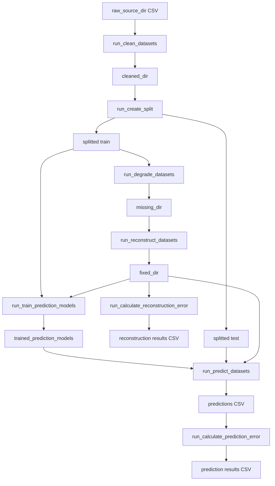
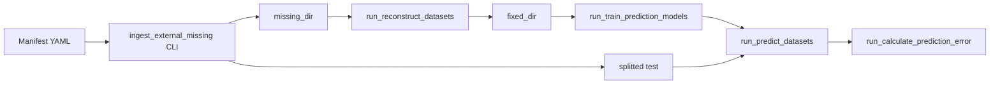

# Programmatic API reference (`framework`)

This document describes the **Python library** exposed by the `framework` package under `src/framework/` and configuration loading from `utils.config_loader`. The main guide to the experiment, data directories, and the Makefile is in [README.md](../README.md).

## Table of contents

1. [Prerequisites and imports](#1-prerequisites-and-imports)
2. [Configuration model](#2-configuration-model)
3. [Full pipeline: `run_pipeline_full`](#3-full-pipeline-run_pipeline_full)
4. [Pipeline step reference (`run_*`)](#4-pipeline-step-reference-run_)
5. [Outside the library API (CLI / Streamlit)](#5-outside-the-library-api-cli--streamlit)
6. [Data dependencies between steps](#6-data-dependencies-between-steps)
7. [Usage examples](#7-usage-examples)
8. [FAQ and common issues](#8-faq-and-common-issues)
9. [Extensibility (plugins and entry points)](#9-extensibility-plugins-and-entry-points)

---

## 1. Prerequisites and imports

- **Python**: `>= 3.11` (see `pyproject.toml`).
- **Dependencies**: from the repository root, e.g. `uv sync`.
- **Module path**: import as if the `src/` directory is on `PYTHONPATH`.

**Option A — `PYTHONPATH` (from the repo root):**

```bash
export PYTHONPATH=src
python your_script.py
```

**Option B — editable install:**

```bash
uv pip install -e .
```

The wheel is built from the `src` tree ([`pyproject.toml`](../pyproject.toml): `[tool.hatch.build.targets.wheel] packages = ["src"]`).

**Typical imports:**

```python
from framework import (
    RunConfig,
    PipelineFullResult,
    run_clean_datasets,
    run_create_split,
    run_degrade_datasets,
    run_reconstruct_datasets,
    run_calculate_reconstruction_error,
    run_train_prediction_models,
    run_predict_datasets,
    run_calculate_prediction_error,
    run_pipeline_full,
    PathsConfig,
    MetricsConfig,
)
from utils.config_loader import (
    Config,
    load_config,
    load_prediction_models_config,
    PredictionModelsConfig,
)
```

Public exports from `framework` are defined in [`src/framework/__init__.py`](../src/framework/__init__.py).

---

## 2. Configuration model

### 2.1. Main file `config/config.yaml` → `Config`

- **`load_config(config_path: str = "config/config.yaml") -> Config`** — loads YAML from disk.
- **`Config.from_dict(data: dict, config_path: str = "") -> Config`** — builds an object from an in-memory mapping (e.g. after `yaml.safe_load`). **Does not write** a file; `config_path` is for information / logging only.

### 2.2. `RunConfig` — YAML document + programmatic overrides

The [`RunConfig`](../src/framework/config_models.py) class holds the **full** configuration mapping:

- **`RunConfig.from_yaml(path: str) -> RunConfig`** — loads a file.
- Property **`data`** — mutable `dict`; nested keys can be changed before building `Config`.
- **`to_config() -> Config`** — `Config.from_dict(self.data, self.config_path)`.

Read-only helper views:

| Property | Type | Meaning |
|----------|------|---------|
| `paths` | `PathsConfig` | Paths under `data.*` (e.g. `raw_source_dir`, `missing_dir`, `fixed_dir`, results directories). |
| `metrics` | `MetricsConfig` | Reconstruction and prediction error metrics from YAML. |

**`MetricsConfig`** exposes:

- **`reconstruction`** — `ReconstructionErrorMetricsView` (`compute`, `primary_metric`, `primary_metric_objective`).
- **`prediction`** — `PredictionErrorMetricsView` (`compute`, `primary_metric`, `primary_metric_lower_is_better`).

YAML keys in detail are documented in [README.md](../README.md) and comments in [`config/config.yaml`](../config/config.yaml).

### 2.3. Mode `pipeline.entry: external_missing`

`Config` provides, among others:

| Method | Description |
|--------|-------------|
| `get_pipeline_entry()` | `"standard"` or `"external_missing"`. |
| `is_pipeline_external_missing()` | `True` when the entry is `external_missing`. |
| `get_external_missing_manifest_path()` | Path to the ingest manifest YAML. |
| `get_external_missing_output_missing_dir()` | Output “missing” directory (or defaults to `get_missing_dir()`). |
| `get_external_missing_output_test_dir()` | Test output directory (or defaults to `get_splitted_test_dir()`). |
| `get_external_missing_output_train_dir()` | Clean train output directory (or defaults to `get_splitted_train_dir()`). |
| `get_external_missing_ingest_state_path()` | Ingest state JSON (used e.g. for original-train prediction filtering). |

### 2.4. `config/prediction_models_config.yaml` → `PredictionModelsConfig`

- **`load_prediction_models_config(config_path: str = "config/prediction_models_config.yaml")`** returns **`PredictionModelsConfig`**, whose **`__init__` always loads from a file on disk**. The repository has **no** `PredictionModelsConfig.from_dict`.

**Changing parameters programmatically without editing the repo:**

1. Build a dict (e.g. `yaml.safe_load` from a template), modify it, write a **temporary** `.yaml` file, then call `load_prediction_models_config(path_to_temp)`.

```python
import tempfile
import yaml
from pathlib import Path
from utils.config_loader import load_prediction_models_config

base = Path("config/prediction_models_config.yaml")
with open(base, encoding="utf-8") as f:
    pred_data = yaml.safe_load(f)
pred_data.setdefault("global_training", {})["max_epochs"] = 3

with tempfile.NamedTemporaryFile(mode="w", suffix=".yaml", delete=False, encoding="utf-8") as tmp:
    yaml.safe_dump(pred_data, tmp, sort_keys=False)
    tmp_path = tmp.name

pred_config = load_prediction_models_config(tmp_path)
```

---

## 3. Full pipeline: `run_pipeline_full`

```python
def run_pipeline_full(
    config: Config,
    pred_config: Optional[PredictionModelsConfig] = None,
) -> PipelineFullResult
```

Defined in [`src/framework/runs.py`](../src/framework/runs.py).

**Step order** (same as `make pipeline-full`): **1 → 2 → 3 → 4 → 5 → 7 → 8 → 9**.

- If `pred_config is None`, **`load_prediction_models_config()`** is used with the default path.
- Does **not** run step **6** (reconstruction dashboard) or **10** (prediction dashboard) — those are separate Streamlit apps.

**`PipelineFullResult`** (`dataclass`):

| Field | Type | Meaning |
|-------|------|---------|
| `ok` | `bool` | `True` when every step returned success (`True` from `run_*`). |
| `failed_step` | `str \| None` | Name of the first step that returned `False`, or `None`. |
| `message` | `str` | Short message. |
| `steps_completed` | `list[str] \| None` | Names of steps completed before a failure (or all steps on success). |

Step names: `clean_datasets`, `create_split`, `degrade_datasets`, `reconstruct_datasets`, `calculate_reconstruction_error`, `train_prediction_models`, `predict_datasets`, `calculate_prediction_error`.

---

## 4. Pipeline step reference (`run_*`)

All functions below are re-exported from `framework` and delegate to `src/N_*.py` modules (dynamic import in `runs.py`).

### 4.1. Important: boolean return semantics

**Do not treat `True` as a guarantee of “zero business-level errors”.** Many scripts end with `return True` after a summary even when some files failed or were skipped (e.g. degradation may return `True` with `errors > 0`). For strict quality control, inspect logs or output artifacts.

**`run_pipeline_full`** likewise treats a step as successful when the corresponding `run_*` returns `True` — with the same limitations.

---

### `run_clean_datasets`

Source: [`src/1_clean_datasets.py`](../src/1_clean_datasets.py).

```python
def run_clean_datasets(
    config,
    input_dir: str | None = None,
    output_dir: str | None = None,
    dataset: str | None = None,
) -> bool
```

| Parameter | Description |
|-----------|-------------|
| `input_dir` | Defaults to `config.get_raw_source_dir()`. |
| `output_dir` | Defaults to `config.get_cleaned_dir()`. |
| `dataset` | If set (e.g. `"series.csv"`), only that file under `input_dir` is cleaned. |

---

### `run_create_split`

Source: [`src/2_create_split.py`](../src/2_create_split.py).

```python
def run_create_split(
    config,
    input_dir: str | None = None,
    output_dir: str | None = None,
    dataset: str | None = None,
    test_samples: int | None = None,
) -> bool
```

| Parameter | Description |
|-----------|-------------|
| `input_dir` | Defaults to `config.get_cleaned_dir()`. |
| `output_dir` | Defaults to `config.get_splitted_dir()` (subdirs `train/` and `test/`). |
| `dataset` | Optionally a single filename. |
| `test_samples` | Defaults to `config.get_test_samples()`. |

---

### `run_degrade_datasets`

Source: [`src/3_degrade_datasets.py`](../src/3_degrade_datasets.py).

```python
def run_degrade_datasets(
    config,
    dataset_files: List[str] | None = None,
    techniques: List[str] | None = None,
    rates: List[float] | None = None,
    iterations: int | None = None,
    seed: int | None = None,
    force: bool = False,
) -> bool
```

| Parameter | Description |
|-----------|-------------|
| `dataset_files` | List of **absolute or relative paths** to training CSVs; if `None`, uses `config.get_datasets()`. |
| `techniques` | Defaults from config (`missingness_techniques`). |
| `rates` | Fractions in `[0.0, 1.0]`; defaults from config. |
| `iterations` | Defaults to `config.get_iterations()`. |
| `seed` | Defaults to `config.get_seed()`. |
| `force` | Passed into degradation tasks (overwrite / re-run per script logic). |

Output goes to `config.get_missing_dir()`. Parallelism: `config.get_n_jobs()`.

---

### `run_reconstruct_datasets`

Source: [`src/4_reconstruct_datasets.py`](../src/4_reconstruct_datasets.py).

```python
def run_reconstruct_datasets(
    config,
    models: List[str] | None = None,
    filter_dataset: List[str] | None = None,
    filter_technique: List[str] | None = None,
    filter_rate: List[int] | None = None,
    filter_iteration: List[int] | None = None,
    force: bool = False,
) -> bool
```

| Parameter | Description |
|-----------|-------------|
| `models` | Model names; if the list contains `"all"`, all keys from `RECONSTRUCTION_MODELS` are used. If `None` — `config.get_reconstruction_models()`. |
| `filter_*` | Filter degraded files by metadata parsed from filenames (dataset, technique, missing percentage, iteration). |
| `force` | When `True`, overwrite is forced; otherwise `config.get_overwrite_existing()` (among others) applies. |

Input: `config.get_missing_dir()`, output: `config.get_fixed_dir()`.

---

### `run_calculate_reconstruction_error`

Source: [`src/5_calculate_reconstruction_error.py`](../src/5_calculate_reconstruction_error.py).

```python
def run_calculate_reconstruction_error(config) -> bool
```

Validates the metric list and `primary_metric` against known keys; returns `False` on validation error. Uses directories from `config` (`source_dir`, `missing_dir`, `fixed_dir`, reconstruction results dir).

---

### `run_train_prediction_models`

Source: [`src/7_train_prediction_models.py`](../src/7_train_prediction_models.py).

```python
def run_train_prediction_models(
    config,
    pred_config,
    models=None,
    iterations=None,
    force=False,
) -> bool
```

| Parameter | Description |
|-----------|-------------|
| `models` | Subset of models to train; must appear in `pred_config` training lists (global + ML). |
| `iterations` | Defaults to `pred_config.get_training_iterations()`. |
| `force` | Together with `config.get_overwrite_prediction()` controls overwriting. |

Collects series from train and (per flags in `config`) from reconstruction — see `get_predict_on_original_train()` / `get_predict_on_reconstructed()`. Checkpoint output directory in the script: `"trained_prediction_models"`.

---

### `run_predict_datasets`

Source: [`src/8_predict_datasets.py`](../src/8_predict_datasets.py).

```python
def run_predict_datasets(
    config,
    pred_config,
    models=None,
    models_dir="trained_prediction_models",
) -> bool
```

| Parameter | Description |
|-----------|-------------|
| `models` | If `None`, selection comes from `config.get_prediction_models()` or all available models. |
| `models_dir` | Directory of trained model artifacts. |

In **`external_missing`** mode, predictions on original train may be limited to manifest datasets — logic uses the state file from `get_external_missing_ingest_state_path()`.

---

### `run_calculate_prediction_error`

Source: [`src/9_calculate_prediction_error.py`](../src/9_calculate_prediction_error.py).

```python
def run_calculate_prediction_error(config, pred_config=None) -> bool
```

The **`pred_config`** argument exists for **library API compatibility**; the function body **ignores** it (`_ = pred_config`). Metrics and paths come from `config` and prediction directories.

---

## 5. Outside the library API (CLI / Streamlit)

You do **not** invoke the following via `from framework import ...`:

| Piece | File / tool | Notes |
|-------|-------------|--------|
| Reconstruction error dashboard (step 6) | `src/6_visualize_reconstruction_error.py` | Streamlit |
| Prediction dashboard (step 10) | `src/10_visualize_prediction.py` | Streamlit |
| External missingness ingest | `src/ingest_external_missing.py` | CLI; needs `pipeline.entry` and manifest — template: [`config/external_missing_manifest.example.yaml`](../config/external_missing_manifest.example.yaml) |
| SD hyperparameter search | `src/optimization/optimize_sd_hyperparams.py` | CLI, Optuna |

Example CLI usage (from repo root):

```bash
uv run python src/ingest_external_missing.py
uv run streamlit run src/6_visualize_reconstruction_error.py
```

Details of the **external missing** flow are in [README.md](../README.md) (section “Alternate entry: external missing”).

---

## 6. Data dependencies between steps

### 6.1. Standard flow (API steps 1–5, 7–9)



### 6.2. External missing (ingest → reconstruction → prediction)



Steps **1–3** (clean, split, degrade) are usually **skipped** when data is introduced via ingest.

---

## 7. Usage examples

### 7.1. Full pipeline with result handling

```python
from utils.config_loader import load_config
from framework import run_pipeline_full

config = load_config("config/config.yaml")
result = run_pipeline_full(config)

if not result.ok:
    print("Failed at step:", result.failed_step)
    print(result.message)
    print("Completed before failure:", result.steps_completed)
else:
    print("OK, completed:", result.steps_completed)
```

### 7.2. Full pipeline with a custom prediction-models config file

```python
from utils.config_loader import load_config, load_prediction_models_config
from framework import run_pipeline_full

config = load_config("config/config.yaml")
pred = load_prediction_models_config("config/prediction_models_config.yaml")
result = run_pipeline_full(config, pred_config=pred)
```

### 7.3. Reconstruction and reconstruction-error metrics only (steps 4 and 5)

Assumption: `missing_dir` already contains degraded CSVs.

```python
from utils.config_loader import load_config
from framework import run_reconstruct_datasets, run_calculate_reconstruction_error

config = load_config("config/config.yaml")
run_reconstruct_datasets(config)
run_calculate_reconstruction_error(config)
```

### 7.4. Single file: clean and split

```python
from utils.config_loader import load_config
from framework import run_clean_datasets, run_create_split

config = load_config("config/config.yaml")
name = "my_series.csv"
run_clean_datasets(config, dataset=name)
run_create_split(config, dataset=name, test_samples=120)
```

### 7.5. Degradation with list overrides (techniques, rates, files)

```python
from pathlib import Path
from utils.config_loader import load_config
from framework import run_degrade_datasets

config = load_config("config/config.yaml")
train_dir = Path(config.get_splitted_train_dir())
files = [str(train_dir / "A.csv"), str(train_dir / "B.csv")]

run_degrade_datasets(
    config,
    dataset_files=files,
    techniques=["MCAR"],
    rates=[0.1, 0.2],
    iterations=1,
    seed=123,
    force=False,
)
```

### 7.6. Reconstruction: filters and a subset of models

```python
from utils.config_loader import load_config
from framework import run_reconstruct_datasets

config = load_config("config/config.yaml")
run_reconstruct_datasets(
    config,
    models=["interpolate_linear", "knn"],
    filter_dataset=["my_series"],
    filter_technique=["MCAR"],
    filter_rate=[10, 20],
    filter_iteration=[1],
    force=False,
)
```

### 7.7. Train, predict, prediction error (7 → 8 → 9)

```python
from utils.config_loader import load_config, load_prediction_models_config
from framework import (
    run_train_prediction_models,
    run_predict_datasets,
    run_calculate_prediction_error,
)

config = load_config("config/config.yaml")
pred = load_prediction_models_config()

run_train_prediction_models(
    config, pred, models=["lstm", "xgboost"], iterations=2, force=True
)
run_predict_datasets(config, pred, models=["lstm", "xgboost"], models_dir="trained_prediction_models")
run_calculate_prediction_error(config, pred)
```

### 7.8. In-memory config (`RunConfig` + path override)

```python
from framework import RunConfig
from framework import run_degrade_datasets

rc = RunConfig.from_yaml("config/config.yaml")
rc.data.setdefault("data", {})["missing_dir"] = "experiments/run42/missing"
config = rc.to_config()
run_degrade_datasets(config)
```

Alternative without `RunConfig`:

```python
import yaml
from utils.config_loader import Config
from framework import run_create_split

with open("config/config.yaml", encoding="utf-8") as f:
    data = yaml.safe_load(f)
data.setdefault("split", {})["test_samples"] = 50
config = Config.from_dict(data, config_path="")
run_create_split(config)
```

### 7.9. À la carte steps (partial standard chain)

```python
from utils.config_loader import load_config, load_prediction_models_config
from framework import (
    run_clean_datasets,
    run_create_split,
    run_degrade_datasets,
    run_reconstruct_datasets,
)

config = load_config("config/config.yaml")

run_clean_datasets(config)
run_create_split(config)
run_degrade_datasets(config)
run_reconstruct_datasets(config)
# ... further steps as needed
```

### 7.10. Reading path and metric views from `RunConfig`

```python
from framework import RunConfig

rc = RunConfig.from_yaml("config/config.yaml")
print(rc.paths.missing_dir, rc.paths.fixed_dir)
print(rc.metrics.reconstruction.primary_metric)
print(rc.metrics.prediction.primary_metric)
```

---

## 8. FAQ and common issues

**`ModuleNotFoundError: No module named 'framework'` or `'utils'`**  
Set `PYTHONPATH=src` or install the package editable from the repo root.

**A step logs exceptions but the function returns `True`**  
See [section 4.1](#41-important-boolean-return-semantics). Inspect output file counts or logs if you need strict validation.

**`run_degrade_datasets` returns `False` with “No datasets”**  
Fill `datasets.selected` in YAML or pass explicit `dataset_files` pointing at existing files under `splitted/train`.

**`run_train_prediction_models`: no training data**  
Enable `prediction.predict_on_original_train` / `predict_on_reconstructed` in `config` as needed and ensure train and/or `fixed_dir` files exist.

**`run_predict_datasets`: no models**  
Check `models_dir`, train models with step 7, and optionally `prediction_models.selected` in the main `config.yaml`.

**`external_missing` mode**  
Set `pipeline.entry: external_missing`, configure the manifest, run ingest (CLI), then use the API for steps 4, 7, 8, 9. Details: [README.md](../README.md).

---

## 9. Extensibility (plugins and entry points)

Models can be added **without editing this repository** in two ways: **runtime registration** (same process) or **setuptools entry points** (separate installable package).

### API

From `framework` (or `framework.plugin_registry`):

| Function | Role |
|----------|------|
| `register_reconstruction_model(name, fn, *, overwrite=False)` | `fn(series: pd.Series) -> pd.Series` (wrap SD-style kwargs in a closure if needed). |
| `register_prediction_model(name, fn, *, gpu=False, deterministic=False, overwrite=False)` | Same contract as built-in predictors: `(train_series, horizon, **model_params) -> pd.Series`. |
| `get_reconstruction_models()` / `get_prediction_models()` | Merged built-in + entry-point + runtime registrations. |
| `clear_plugin_registry()` | Testing only — clears runtime state and entry-point cache. |

Merge order: **built-ins**, then **entry points**, then **`register_*`** (each step overrides the same name).

### Entry point groups

Declare these under **`[project.entry-points]`** in **your** package’s `pyproject.toml` (see comments in [`pyproject.toml`](../pyproject.toml)):

| Group | Meaning |
|-------|---------|
| `units_missrecopred.reconstruction` | Entry **name** = model id; value = `module:callable`. |
| `units_missrecopred.prediction` | Same; loaded models default to `gpu=False`, `deterministic=False` unless you also register with `register_prediction_model(..., gpu=True, ...)`. |

After `pip install` / `uv add` your package, the framework discovers plugins on first `get_*` call.

### Prediction plugins and step 7

Global Darts / XGBoost training in step **7** is unchanged. Plugin prediction models are intended for the **per-file** path (fit inside predict, like Holt–Winters): add the model id to `per_file_training_models` in `prediction_models_config.yaml` and optional hyperparameters under a YAML block named like the model. See [README.md](../README.md) (Adding New Models — plugins).

---

*This document matches the repository layout at the time of writing. YAML field details and data directory descriptions are in [README.md](../README.md) and under `config/`.*
